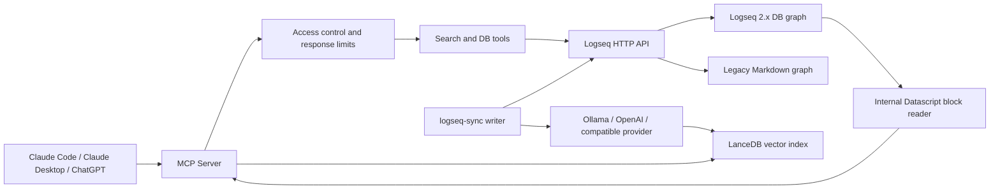

# Vector Search Setup Guide

Semantic search over your Logseq graph using local or hosted AI embeddings. Find notes by meaning rather than exact keywords - works across languages and concepts.

## Architecture



## How It Works

1. File graphs read `.md` files directly from disk; DB graphs read page data through Logseq's API
2. Each page is chunked into blocks and embedded using the configured provider
3. Embeddings are stored in a [LanceDB](https://lancedb.com) database on your machine
4. `vector_search` queries combine vector similarity + full-text search with RRF reranking
5. When your notes change, an incremental sync re-embeds only changed pages

LanceDB always runs locally. With Ollama, note text also stays local. OpenAI and
other hosted providers receive the chunks and search queries they embed; review
the provider's data-handling policy before enabling a hosted service.

---

## Prerequisites

### 1. Choose an embedding provider

Install Ollama from [ollama.com](https://ollama.com) and pull an embedding model:

```bash
ollama pull qwen3-embedding:8b   # recommended - high quality, 4096 dims
# or
ollama pull nomic-embed-text     # lighter alternative
```

Confirm it's running:

```bash
curl http://localhost:11434/api/embed -d '{"model":"qwen3-embedding:8b","input":["test"]}'
```

For a hosted provider, obtain an API key and the provider's embedding model
name. OpenAI works with its default base URL. Other services must expose an
OpenAI-compatible `POST /embeddings` endpoint and provide the base URL ending in
`/v1` (or the equivalent API root).

### 2. Vector extras

Install the optional vector dependencies. The `[vector]` extra pulls in LanceDB, PyArrow, and watchdog.

**From PyPI (once released):**
```bash
uv pip install "mcp-logseq[vector]"
```

**From a local checkout (development):**
```bash
cd "<REPO_DIR>"
uv sync --extra vector
```

---

## Configuration

Create a directory for all vector search files and a config file inside it:

```bash
mkdir -p ~/.logseq-vector
```

`~/.logseq-vector/config.json`:

```json
{
  "logseq_graph_path": "~/Library/Mobile Documents/iCloud~com~logseq~logseq/Documents",
  "exclude_tags": ["private"],
  "vector": {
    "enabled": true,
    "db_path": "~/.logseq-vector/db",
    "embedder": {
      "provider": "ollama",
      "model": "qwen3-embedding:8b",
      "base_url": "http://localhost:11434"
    },
    "include_journals": true,
    "exclude_tags": ["no-index"],
    "min_chunk_length": 50
  }
}
```

The example above uses Ollama. To use OpenAI instead, replace the `embedder`
block with:

```json
"embedder": {
  "provider": "openai",
  "model": "text-embedding-3-small",
  "api_key": "replace-with-your-api-key"
}
```

OpenAI defaults to `https://api.openai.com/v1`. The optional `dimensions`
field requests a specific output size on models that support it:

```json
"embedder": {
  "provider": "openai",
  "model": "text-embedding-3-small",
  "api_key": "replace-with-your-api-key",
  "dimensions": 512
}
```

For another service implementing the OpenAI embeddings contract:

```json
"embedder": {
  "provider": "openai-compatible",
  "model": "provider-model-name",
  "base_url": "https://embeddings.example.com/v1",
  "api_key": "replace-if-required"
}
```

`api_key` is optional for `openai-compatible`, which allows an unauthenticated
local service. It is required for `openai`.

This keeps everything in one place:

```text
~/.logseq-vector/
  config.json    you edit this
  db/            generated, do not edit
```

### Logseq 2.x DB graphs

Set `LOGSEQ_DB_MODE=true` for a Logseq 2.x DB graph or `false` for a legacy
Markdown/file graph. Use an explicit value for dedicated deployments. The
sync writer uses the DB API for DB graphs and local graph files for file
graphs. DB-mode sync requires Logseq to be running with its HTTP API enabled,
and `LOGSEQ_API_TOKEN` must be available to the sync process.

DB graph state is tracked by page UUID. After changing index filters or
switching between file and DB mode, run a full rebuild:

```bash
LOGSEQ_DB_MODE=true logseq-sync --rebuild
```

| Field | Required | Description |
| --- | --- | --- |
| `logseq_graph_path` |  | Path to a file graph directory, or the configured graph path used for DB-mode status reporting |
| `exclude_tags` | no | **Project-level privacy filter** - pages with these tags are hidden from all tools (list, search, query, get content) *and* excluded from the vector index. Use this for pages with sensitive content (e.g. API keys, personal notes). |
| `vector.enabled` |  | Must be `true` to activate vector tools |
| `vector.db_path` |  | Where to store the vector DB - keep it local, not in iCloud |
| `vector.embedder.provider` | no | `ollama` (default), `openai`, or `openai-compatible` |
| `vector.embedder.model` | provider-dependent | Defaults to `nomic-embed-text` for Ollama and `text-embedding-3-small` for OpenAI; required for `openai-compatible` |
| `vector.embedder.base_url` | provider-dependent | Defaults to local Ollama or OpenAI's API root; required for `openai-compatible` |
| `vector.embedder.api_key` | provider-dependent | Required for OpenAI; optional bearer token for `openai-compatible`; ignored by Ollama |
| `vector.embedder.dimensions` | no | Positive integer requested from an OpenAI-compatible endpoint; changing it requires a rebuild |
| `vector.include_journals` | no | Index journal pages (default: `true`) |
| `vector.exclude_tags` | no | Additional tags to skip from the vector index only (additive with top-level `exclude_tags`). Use for noise filtering - e.g. large reference dumps that pollute semantic search but are fine to read directly. (default: `[]`) |
| `vector.min_chunk_length` | no | Minimum characters per chunk (default: `50`) |
| `LOGSEQ_DB_MODE` | no | Set to `true` for Logseq 2.x DB graphs or `false` for legacy Markdown/file graphs. `auto` is legacy compatibility mode only. |

**Important:** keep `db_path` outside your iCloud-synced Logseq folder. The DB is a generated binary artifact - syncing it to iCloud wastes bandwidth and can cause corruption.

If `config.json` contains an API key, do not commit or share it. Restrict it to
your user account, for example with `chmod 600 ~/.logseq-vector/config.json`.

---

## MCP Server Setup

Point the MCP server at your config file via the `LOGSEQ_CONFIG_FILE`
environment variable. Use [INSTALLATION.md](INSTALLATION.md) for current
Claude Code, Claude Desktop, and ChatGPT deployment instructions. Set
`LOGSEQ_DB_MODE=true` for a DB graph or `false` for a legacy file graph.

For a local checkout, install the vector extra with `uv sync --extra vector`
and launch the executable from that checkout. Do not use a generic cached
`uv --with mcp-logseq` command when verifying which code is running.

If `LOGSEQ_CONFIG_FILE` is not set or `vector.enabled` is `false`, the vector tools are silently not registered. All other tools work normally.

---

## First Sync

Before using `vector_search`, you need to build the initial index. This can take several minutes depending on the size of your graph and your embedding model.

```bash
export LOGSEQ_CONFIG_FILE=~/.logseq-vector/config.json
uv run --project "<REPO_DIR>" logseq-sync --once
```

You'll see progress as batches of pages are embedded. Check status when done:

```bash
uv run --project "<REPO_DIR>" logseq-sync --status
```

---

## Talking to Claude

These tools are called by Claude on your behalf - you don't invoke them directly. Just talk naturally:

```
"Find my notes about shadow work or Jung"
"Search for meeting notes with action items from last week"
"What did I write about machine learning?"
"Is my search index up to date?"
"Sync the vector DB"
"Rebuild the search index from scratch"
```

---

## MCP Tools Reference

Once the server is restarted with `LOGSEQ_CONFIG_FILE` set, three new tools are available to Claude.

### `vector_search`

Semantic search across your notes. Claude calls this when you ask it to find notes by topic, concept, or meaning.

| Parameter | Type | Default | Description |
| --- | --- | --- | --- |
| `query` | string | required | Natural language query |
| `top_k` | integer | 5 | Number of results (max 20) |
| `search_mode` | string | `hybrid` | `hybrid`, `vector`, or `keyword` |
| `filter_tags` | array | - | Only return pages with ALL these tags |
| `filter_page` | string | - | Restrict to a single page |

**Sync ownership:** `vector_search` is read-only and does not start a sync. Run
the external `logseq-sync` writer on the host that owns the graph and vector DB.
For DB graphs, the writer reads changes through the Logseq API rather than file
system events.

### `sync_vector_db`

This tool is an informational pointer to the external `logseq-sync` process. It
does not write to the vector DB from the MCP server.

| Parameter | Type | Default | Description |
| --- | --- | --- | --- |
| `rebuild` | boolean | `false` | Ignored by this read-only pointer; run `logseq-sync --rebuild` externally |

Run `logseq-sync --rebuild` if you change the embedding provider, model, or
configured dimensions.

### `vector_db_status`

Shows the current state of the vector DB. Claude calls this when you ask whether the index is up to date.

```text
Vector DB Status
  Embedder:     ollama/qwen3-embedding:8b
  Dimensions:   4096
  Total chunks: 1203
  Total pages:  461
  Last sync:    2026-03-21T11:21:18Z
  Staleness:    Up to date
```

---

## CLI: `logseq-sync`

For syncing outside of the MCP server - useful for initial indexing, automation, or continuous watch mode.

```bash
export LOGSEQ_CONFIG_FILE=~/.logseq-vector/config.json

uv run --project "<REPO_DIR>" logseq-sync --once     # incremental sync and exit
uv run --project "<REPO_DIR>" logseq-sync --watch    # watch and sync changes
uv run --project "<REPO_DIR>" logseq-sync --rebuild  # drop DB and re-index
uv run --project "<REPO_DIR>" logseq-sync --status   # staleness report
```

For continuous sync without the MCP auto-trigger, `--watch` is the recommended approach. It debounces file system events and re-embeds only changed files.

---

## Troubleshooting

### Vector tools not appearing

- Confirm `LOGSEQ_CONFIG_FILE` is set in the MCP server env
- Confirm `vector.enabled: true` in the config file
- Check the server log: `~/.cache/mcp-logseq/mcp_logseq.log`
- Look for: `Vector search tools registered (3 tools)`

### "Cannot connect to Ollama"

- Confirm Ollama is running: `ollama list`
- Confirm the model is downloaded: `ollama pull qwen3-embedding:8b`
- Check `base_url` in config matches your Ollama address

### Hosted embedding request fails

- Confirm `api_key`, `model`, and `base_url` belong to the same provider
- For `openai-compatible`, set `base_url` to the API root immediately before
  `/embeddings`; for example, `https://embeddings.example.com/v1`
- A `401` or `403` usually means the API key is missing, invalid, or lacks
  access to the selected model
- Check provider rate limits if a sync succeeds for some batches and skips
  others

### Embedder mismatch error on sync

If you change the provider, model, or configured dimensions after an initial
sync:

```bash
logseq-sync --rebuild
```

This drops the existing DB and re-indexes from scratch with the new embedding
space. Rotating only `api_key` does not require a rebuild.

### Slow first sync

First-sync time depends on graph size, model size, provider latency, and rate
limits. Subsequent incremental syncs are much faster because only changed files
are re-embedded.

### Pages missing from results

Run `vector_db_status` to check chunk and page counts. If a page is missing, it may have been skipped due to:
- All chunks being under `min_chunk_length`
- The page having a tag listed in `exclude_tags` (top-level or `vector.exclude_tags`)
- A timeout during the initial sync (run `--once` again to pick it up)
